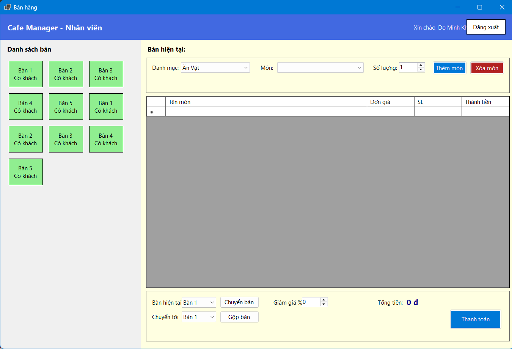
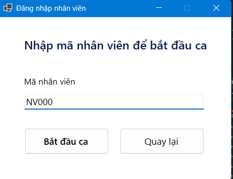
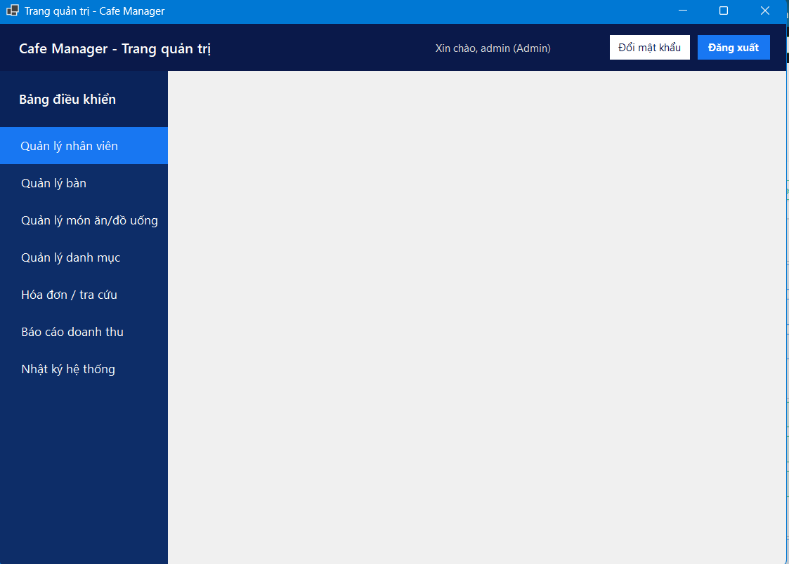

# Coffee Manager (WINFORMS)

A Windows-based café management system built with **C# WinForms** and **ASP.NET Core Web API**.  
The project targets small coffee shops and supports daily operations such as managing tables, orders, invoices, revenue reports, and system logs.

Repository: https://github.com/YoungKevinn/WINFORMS

---

## 🚀 Overview

Coffee Manager is built with a clear **client–server architecture**:

- **WinForms desktop client** for staff and admin users.
- **ASP.NET Core Web API** as the backend service.
- **SQL Server** as the main database.

It started as a university project but is structured so it can be extended and used as a real-world café management solution.

---

## ✨ Features

### 👨‍💼 Staff (Cashier / Waiter)

- Login with **employee code** to start a working shift.
- View and manage the list of tables (status: free / occupied).
- Create and update orders per table:
  - Select category and item.
  - Set quantity, add or remove items.
- Automatically calculate **subtotal, discount (%) and total amount**.
- Process payments and send data to the API as an invoice.

### 👑 Admin

- **Employee management** (view, add, edit, deactivate employees).
- **Table management** (configure tables and status).
- **Menu & category management** for drinks and food.
- **Invoice management / lookup**:
  - Search by invoice ID, date range, table, or employee.
  - View invoice details (items, quantity, price, discount, tax, total).
- **Revenue reports**:
  - Filter by day / month / year.
  - Group by employee or time period.
  - Export to **Excel** / **PDF** and print.
- **System audit log**:
  - Track login, logout and important admin actions.
  - Filter and search logs by time, user, or action.

### 🔐 Common

- Role-based authentication (**Admin** / **Staff**).
- Vietnamese currency formatting (e.g. `25.000 ₫`).
- Consistent date/time formats (`dd/MM/yyyy`, `HH:mm dd/MM/yyyy`).
- Sortable grids: click column headers to sort ascending / descending.

---

## 🛠 Tech Stack

**Backend**

- ASP.NET Core Web API
- Entity Framework Core (Code First)
- SQL Server
- AutoMapper, DTO pattern

**Desktop Client**

- C# WinForms
- HttpClient-based REST API integration
- Panel-based UI for dashboards and management screens

**Tools**

- Visual Studio
- Git & GitHub
- Postman / Swagger for API testing

---

## 🧱 Architecture

- **Presentation layer**: WinForms application for Admin and Staff.
- **API layer**: ASP.NET Core Web API containing business logic, validation and endpoints.
- **Data layer**: EF Core + SQL Server (entities, relationships, migrations).

The client communicates with the API over HTTP, similar to how a real production system separates UI and backend services.

---

## 📸 Screenshots

> (Place your images in the `screenshots/` folder or update the paths below.)

### 1. Staff – Sales screen (tables & orders)



Staff can select a table, add items from categories, adjust quantities, apply discounts and confirm payment.  
The UI shows table status, current order items, and total amount in Vietnamese currency.

---

### 2. Staff – Start shift with employee code



Staff only need to enter their **employee code** to start a shift, making it quick and simple to use during busy hours.

---

### 3. Admin – Management dashboard



Admin dashboard with a left-side navigation panel to access:

- Employee management  
- Table management  
- Menu & category management  
- Invoice lookup  
- Revenue reports  
- System audit log  

---

## ▶️ Getting Started

1. **Clone the repository**

   ```bash
   git clone https://github.com/YoungKevinn/WINFORMS.git

   ---
   2. **Backend – API**

   - Open the API project in Visual Studio.
   - Update the SQL Server connection string in `appsettings.json`.
   - Run database migrations (if needed) and update the database.
   - Start the API project and note the base URL (e.g. `https://localhost:5001`).

3. **Client – WinForms**

   - Open the WinForms solution in Visual Studio.
   - Update the API base URL in the API client configuration/class.
   - Set the WinForms project as the startup project.
   - Run the application.

---

## 📌 Possible Improvements

- Inventory and stock management.
- Customer loyalty / membership module.
- Support for multiple branches.
- Dockerization for easier deployment.

---

## 📄 About This Project

Coffee Manager was developed as a **university proje**


## 📌 Possible Improvements

- Inventory and stock management.
- Customer loyalty / membership module.
- Support for multiple branches.
- Dockerization for easier deployment.

---

## 📄 About This Project

Coffee Manager was developed as a **university project** and as a **portfolio project** to demonstrate:

- Proficiency in **C# WinForms** and **ASP.NET Core Web API**.
- Understanding of **client–server architecture**.
- Experience with reporting, logging, role-based access control, and real-world business workflows in a café environment.

